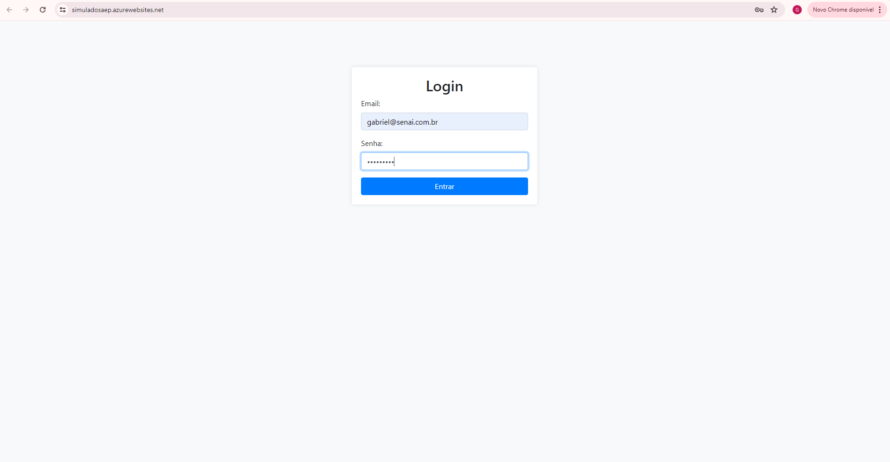
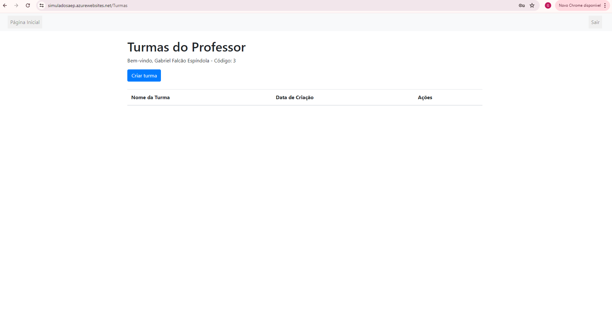
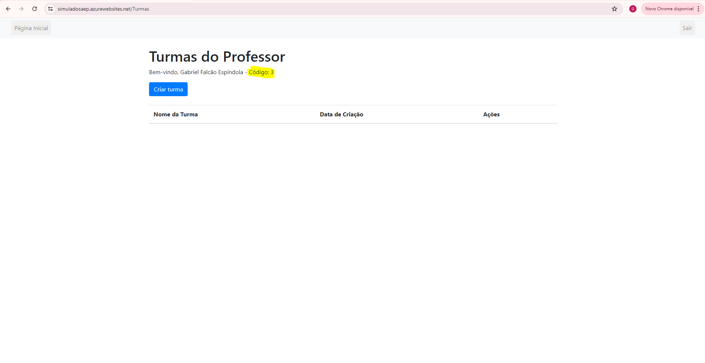
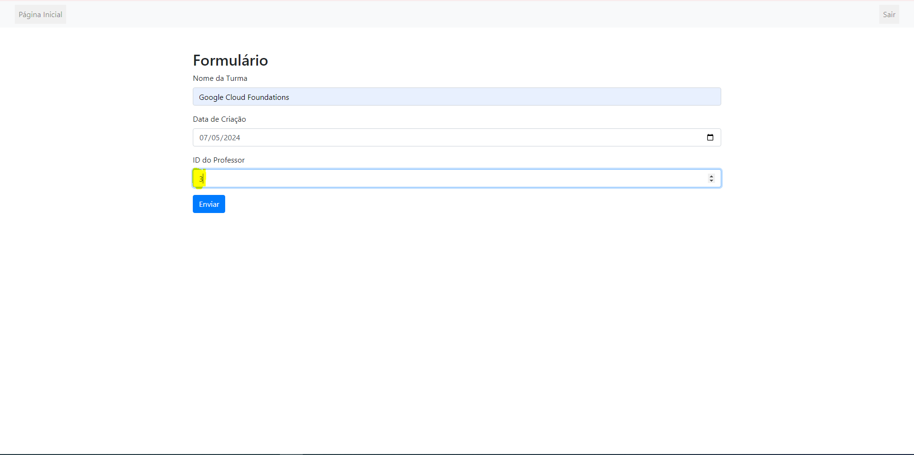

# GabrielFalcaoEspindola-44924962899-SAEP
Realização da prova do SAEP - 10/06/2024

##Projeto 
O projeto foi desenvolvido como para prova prática SAEP, onde o exercício proposta foi elaborar um sistema de cadastro de turmas e atividades para professores de uma escola. 
Até o momento o projeto possui 3 usuários, sendo eles: 

2. Email: gabriel@teste.com.br - Senha: senha1234 
3. Email: marcus@teste.com.br - Senha: senha0000
4. Email: jhonny@teste.com.br - Senha: senha4321

Funcionamento:
1. Na página index podemos colocar qualquer um dos 3 usuários citados acima  

2. E em seguida seremos redirecionados para a página de turmas, onde será possível visualizar todas as turmas vinculadas aquele usuário em específico que foi feito o login. 

3. Nessa página temos algumas opções, como "Criar turma", "Exluir turma", "Visualizar" e "sair". 
   1. O botão de Criar turma irá te redirecionar para um formulário onde será criado uma nova turma assim que for feito o envio 
   2. O botão exluir turma irá deleta-la assim que for confirmado 
   3. O botão visualizar irá te redirecionar para uma outra página onde será listada as atividades daquela turma 
   4. O botão sair irá fazer o logout do sistema 

4. ATENÇÃO! Na hora de fazer o cadastro de uma turma, é necessário visualizar antes o código do professor, para inserir ele no formulário. Conforme imagens abaixo: 
   
   

###EXECUÇÃO LOCAL 
1. Fazer o git clone do repositório

2. Importar a database localizada no diretório com o nome "database" e importa-la para o MySQL

3. Acessar a o arquivo main.py e verificar alterar o user e password de acordo com o seu banco de dados (linhas 23 e 24)
   

5. instalar bibliotecas:
   FastAPI
   pymysql
   Jinja2
   RedirectResponse
   starlette.status
   pymysql

6. No terminal do VSCode, acessar o diretório, por exemplo:
   "cd C:\Users\Aluno\Desktop\Sistema"

7. Ainda no terminal, inicializar o servidor uvicorn com o comando:
   uvicorn main:app --reload
   

8. Enfim, é so abrir o http://127.0.0.1:8000 no seu navegador 
